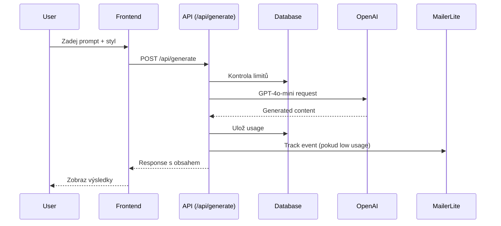
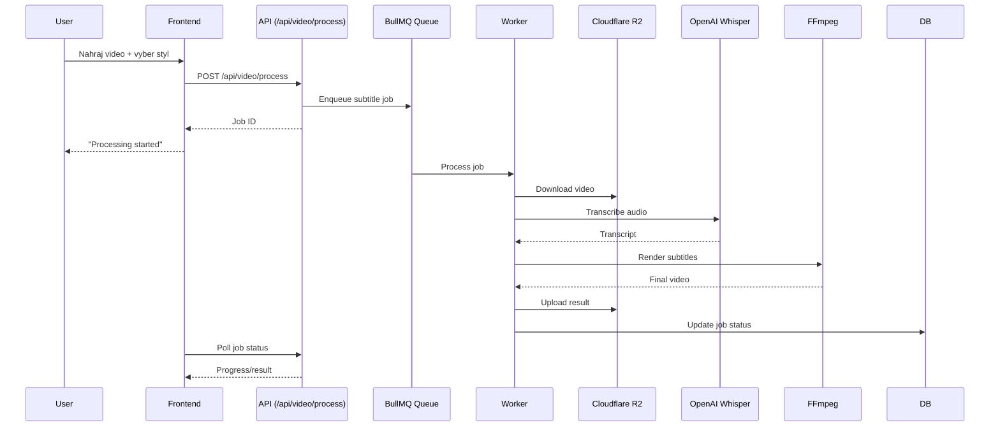
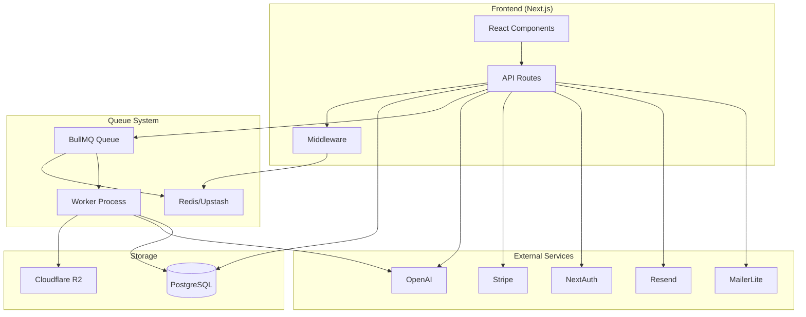

# Architektura systému

## Přehled

Captioni je full-stack aplikace pro generování sociálních médií s AI. Systém kombinuje Next.js frontend s API routes, BullMQ queue systém, a externí služby pro AI, storage a platby.

## Hlavní komponenty

### Web Layer (Next.js)
- **Frontend**: React komponenty, dashboard, generátor
- **API Routes**: REST endpointy pro všechny operace
- **Middleware**: Rate limiting, auth, CORS

### Queue System (BullMQ + Upstash Redis)
- **Queue**: Asynchronní zpracování video jobů
- **Worker**: Background processing titulků
- **Events**: Job tracking a notifikace

### Storage Layer
- **Database**: PostgreSQL (Vercel Postgres)
- **File Storage**: Cloudflare R2 (S3-compatible)
- **Cache**: Upstash Redis

### External Services
- **AI**: OpenAI (GPT-4o-mini + Whisper)
- **Auth**: NextAuth.js + Google OAuth
- **Payments**: Stripe
- **Email**: Resend
- **Analytics**: Plausible

## Systémové diagramy

### Hlavní tok - Text Generation

### Hlavní tok - Video Processing

### Komponentový diagram

## Doménové bloky

### 1. Web Layer (Next.js)
**Účel**: Frontend a API gateway
**Komponenty**:
- React komponenty pro UI
- API routes pro business logiku
- Middleware pro rate limiting a auth

**Klíčové soubory**:
- `src/app/` - Next.js 13+ app router
- `src/components/` - React komponenty
- `middleware.ts` - Rate limiting

### 2. API Routes
**Účel**: Business logika a integrace
**Hlavní endpointy**:
- `/api/generate` - Text generation
- `/api/video/*` - Video processing
- `/api/auth/*` - Authentication
- `/api/stripe/*` - Payments
- `/api/crons/*` - Scheduled tasks

### 3. Queue/Workers (BullMQ)
**Účel**: Asynchronní zpracování
**Komponenty**:
- BullMQ queue pro job management
- Worker procesy pro video processing
- Redis pro queue storage

**Klíčové soubory**:
- `src/queue/worker.ts` - Main worker
- `src/queue/workflows/` - Job processing logic
- `src/server/queue.ts` - Queue management

### 4. Storage (R2 + PostgreSQL)
**Účel**: Data persistence
**Komponenty**:
- PostgreSQL pro structured data
- Cloudflare R2 pro file storage
- Prisma ORM pro database access

**Klíčové soubory**:
- `prisma/schema.prisma` - Database schema
- `src/lib/storage/r2.ts` - R2 integration
- `src/lib/prisma.ts` - Database client

### 5. Authentication (NextAuth)
**Účel**: User management
**Komponenty**:
- Google OAuth provider
- Magic link authentication
- Session management

**Klíčové soubory**:
- `src/lib/auth.ts` - NextAuth configuration
- `src/app/api/auth/` - Auth endpoints

### 6. Payments (Stripe)
**Účel**: Subscription management
**Komponenty**:
- Stripe Checkout pro plány
- Webhook handling
- Usage tracking

**Klíčové soubory**:
- `src/app/api/stripe/` - Stripe integration
- `src/constants/plans.ts` - Plan definitions

## Důležitá rozhodnutí a trade-offs

### 1. Next.js App Router
**Rozhodnutí**: Použití Next.js 13+ app router
**Pro**: Moderní routing, server components, lepší performance
**Proti**: Novější API, méně dokumentace
**Trade-off**: Přijatelný pro nový projekt

### 2. BullMQ + Upstash Redis
**Rozhodnutí**: BullMQ pro queue management
**Pro**: Robustní job processing, retry logic, monitoring
**Proti**: Další závislost, Redis hosting
**Trade-off**: Nutné pro video processing

### 3. Cloudflare R2
**Rozhodnutí**: R2 místo AWS S3
**Pro**: Levnější, S3-compatible API
**Proti**: Méně mature, menší ekosystém
**Trade-off**: Cost-effective pro startup

### 4. Prisma ORM
**Rozhodnutí**: Prisma místo raw SQL
**Pro**: Type safety, migrations, developer experience
**Proti**: Další abstrakce, performance overhead
**Trade-off**: Rychlejší development

### 5. NextAuth.js
**Rozhodnutí**: NextAuth místo custom auth
**Pro**: OAuth providers, session management
**Proti**: Další závislost, méně flexibility
**Trade-off**: Rychlejší implementace

## Performance considerations

### 1. Database
- Prisma connection pooling
- Indexy na často dotazované sloupce
- Pagination pro velké seznamy

### 2. Queue System
- Worker concurrency tuning
- Job prioritization
- Dead letter queue pro failed jobs

### 3. Storage
- R2 presigned URLs pro direct uploads
- CDN pro static assets
- File cleanup cron jobs

### 4. API
- Rate limiting per user/IP
- Response caching kde možno
- Background job processing

## Security considerations

### 1. Authentication
- NextAuth session management
- CSRF protection
- Secure cookies

### 2. API Security
- Rate limiting
- Input validation (Zod)
- CORS configuration

### 3. Data Protection
- PII hashing (IP addresses)
- Secure file uploads
- Environment variable protection

## Monitoring a observability

### 1. Logging
- Structured logging v console
- Error tracking (Sentry)
- Request/response logging

### 2. Metrics
- API response times
- Queue processing times
- Error rates
- User activity

### 3. Alerts
- Failed job notifications
- High error rates
- Queue backlog alerts

## Assumptions & Gaps

### Assumptions
- Vercel Postgres se používá v produkci
- Cloudflare R2 je dostatečně spolehlivé
- Upstash Redis má dostatečnou kapacitu
- OpenAI API je dostupné a stabilní

### Gaps
- Chybí comprehensive error monitoring
- Chybí performance metrics dashboard
- Chybí automated testing
- Chybí backup strategy pro R2
